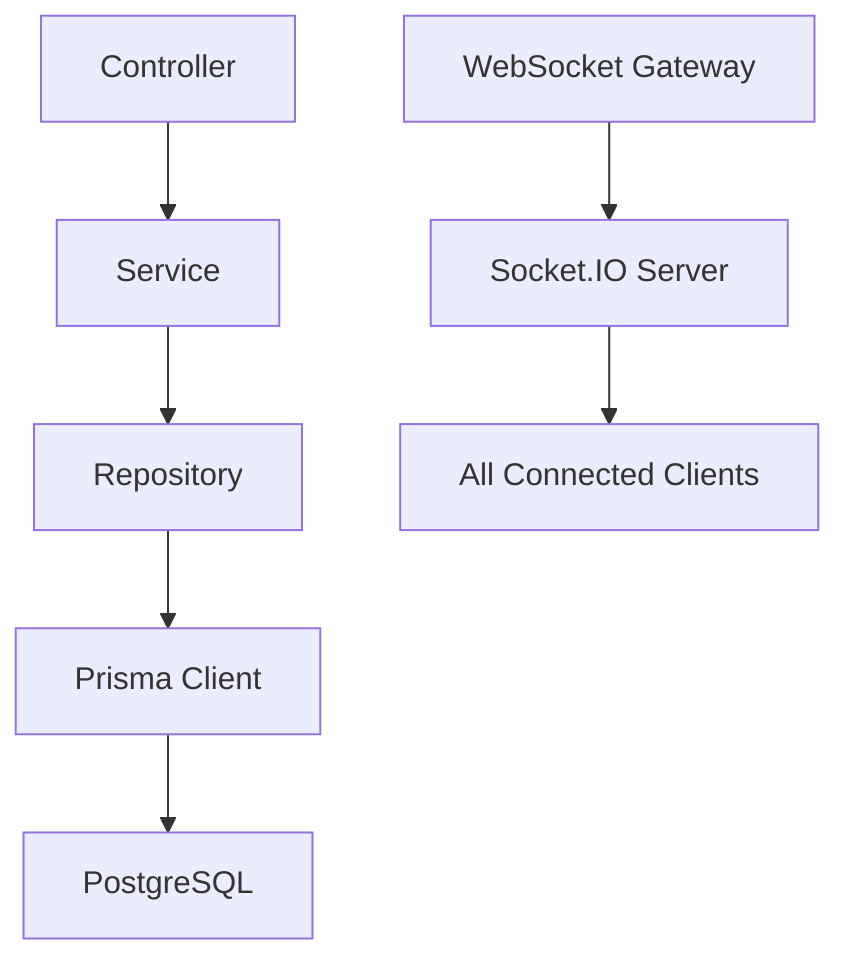
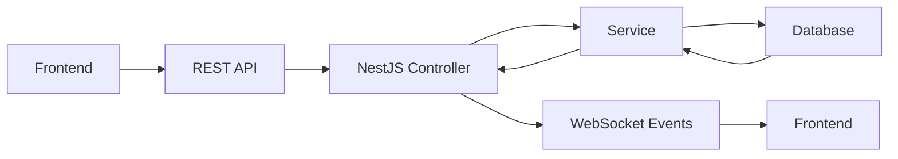

# Архитектурная документация - Бэкенд приложения "Список добрых дел"

## Общая архитектура

### Технологический стек
- **Фреймворк**: NestJS (TypeScript)
- **ORM**: Prisma
- **База данных**: PostgreSQL
- **Аутентификация**: JWT через HttpOnly cookies
- **Реальное время**: Socket.IO
- **Контейнеризация**: Docker + Docker Compose
- **Хеширование**: bcrypt

### Архитектурные принципы
1. **Модульность**: Каждый функциональный блок выделен в отдельный модуль
2. **Слоистая архитектура**: Controller → Service → Repository → Database
3. **Обработка ошибок**: Глобальные фильтры и централизованная обработка
4. **Безопасность**: HttpOnly cookies, CORS, валидация входящих данных
5. **Реактивность**: WebSocket события для мгновенных обновлений UI

## Структура проекта

```
backend/
├── src/
│   ├── main.ts                 # Главный файл приложения
│   ├── app.module.ts           # Корневой модуль
│   ├── config/                 # Конфигурация
│   │   ├── database.config.ts
│   │   ├── jwt.config.ts
│   │   └── app.config.ts
│   ├── modules/                # Модули функциональности
│   │   ├── auth/               # Аутентификация
│   │   │   ├── auth.controller.ts
│   │   │   ├── auth.service.ts
│   │   │   ├── auth.module.ts
│   │   │   └── dto/
│   │   │       ├── login.dto.ts
│   │   │       ├── register.dto.ts
│   │   │       └── delete-user.dto.ts
│   │   ├── users/              # Пользователи
│   │   │   ├── users.controller.ts
│   │   │   ├── users.service.ts
│   │   │   ├── users.module.ts
│   │   │   └── dto/
│   │   │       └── user.dto.ts
│   │   ├── todos/              # Дела
│   │   │   ├── todos.controller.ts
│   │   │   ├── todos.service.ts
│   │   │   ├── todos.module.ts
│   │   │   └── dto/
│   │   │       ├── create-todo.dto.ts
│   │   │       ├── update-todo.dto.ts
│   │   │       └── search-todo.dto.ts
│   │   ├── friends/            # Друзья
│   │   │   ├── friends.controller.ts
│   │   │   ├── friends.service.ts
│   │   │   ├── friends.module.ts
│   │   │   └── dto/
│   │   │       └── friend.dto.ts
│   │   └── gateway/           # WebSocket Gateway
│   │       ├── gateway.module.ts
│   │       └── todo.gateway.ts
│   ├── filters/                # Фильтры ошибок
│   │   └── http-exception.filter.ts
│   ├── interceptors/           # Перехватчики
│   │   └── transform.interceptor.ts
│   ├── decorators/            # Кастомные декораторы
│   │   └── user.decorator.ts
│   ├── guards/                # Guards
│   │   └── jwt-auth.guard.ts
│   ├── types/                 # Типы TypeScript
│   │   └── index.ts
│   └── utils/                 # Утилиты
│       ├── bcrypt.utils.ts
│       └── jwt.utils.ts
├── prisma/
│   ├── schema.prisma          # Схема базы данных
│   └── migrations/            # Миграции
├── docker-compose.yml         # Docker Compose
├── Dockerfile               # Dockerfile для бэкенда
├── package.json             # Зависимости
└── tsconfig.json            # TypeScript конфигурация
```

## Схема базы данных

### User (Пользователи)
```typescript
model User {
  id          String   @id @default(cuid())
  username    String   @unique
  password    String
  createdAt   DateTime @default(now())
  updatedAt   DateTime @updatedAt
  
  // Relations
  todos       Todo[]
  friendships Friendship[] @relation("Following")
  followedBy  Friendship[] @relation("Followers")
  
  @@map("users")
}
```

### Todo (Дела)
```typescript
model Todo {
  id          String   @id @default(cuid())
  title       String
  description String
  name        String   // Имя автора
  createdAt   DateTime @default(now())
  updatedAt   DateTime @updatedAt
  
  // Relations
  authorId    String
  author      User     @relation(fields: [authorId], references: [id], onDelete: Cascade)
  
  @@map("todos")
}
```

### Friendship (Дружба)
```typescript
model Friendship {
  followerId  String
  followingId String
  
  // Relations
  follower    User   @relation("Following", fields: [followerId], references: [id], onDelete: Cascade)
  following   User   @relation("Followers", fields: [followingId], references: [id], onDelete: Cascade)
  
  @@id([followerId, followingId])
  @@map("friendships")
}
```

## API Эндпоинты

### Аутентификация
```
POST   /auth/register    - Регистрация пользователя
POST   /auth/login       - Вход пользователя
DELETE /auth/profile     - Удаление аккаунта
```

### Работа с делами
```
GET    /todos            - Поиск дел с фильтрами
POST   /todos            - Создание дела
PUT    /todos/:id        - Редактирование дела
DELETE /todos/:id        - Удаление дела
```

### Работа с друзьями
```
GET    /friends          - Список друзей
POST   /friends/:userId  - Добавить/удалить из друзей
```

### Системные
```
GET    /health           - Health check
```

## WebSocket События

### Широковещательные события
```typescript
// При создании/обновлении/удалении дела
{
  type: 'todo_updated',
  payload: {
    type: 'created' | 'updated' | 'deleted',
    todo: Todo
  }
}

// При удалении пользователя
{
  type: 'user_deleted',
  payload: {
    userId: string,
    username: string
  }
}

// При изменении дружбы
{
  type: 'friendship_updated',
  payload: {
    type: 'added' | 'removed',
    userId: string,
    username: string
  }
}
```

## Конфигурация

### JWT Конфигурация
```typescript
{
  secret: 'мой_самый_секретный_ключ',
  expiresIn: '1h',
  cookieName: 'access_token',
  prefix: 'Bearer '
}
```

### База данных
```typescript
{
  host: 'localhost',
  port: 5432,
  database: 'good_deeds',
  user: 'postgres',
  password: 'password'
}
```

### Порты
- NestJS: 3000
- PostgreSQL: 5432
- Socket.IO: 3001

## Безопасность

### Аутентификация
- JWT токены через HttpOnly cookies (защищены от XSS атак)
- Срок действия: 1 час
- Префикс: `Bearer `

### Хеширование паролей
- Алгоритм: bcrypt
- Rounds: 10
- Автоматическая соль

### Валидация
- DTO валидация для всех входящих данных
- Проверка прав доступа для CRUD операций
- CORS для фронтенда

## Обработка ошибок

### Глобальные фильтры
```typescript
@Catch(HttpException)
export class HttpExceptionFilter {
  catch(exception: HttpException, host: ArgumentsHost) {
    const response = host.switchToHttp().getResponse();
    const status = exception.getStatus();
    const message = exception.message;
    
    response.status(status).json({
      data: null,
      error: message
    });
  }
}
```

### Формат ответов
```typescript
{
  data: any,
  error?: string
}
```

## Архитектурные диаграммы

### Диаграмма слоев


### Диаграмма потоков данных


## Деплой

### Docker контейнеризация
- Multi-stage build для оптимизации размера
- Health checks для мониторинга состояния
- Environment variables для конфигурации

### CI/CD Pipeline
- Автоматическая сборка Docker образа
- Деплой на staging/production

## Мониторинг

### Логирование
- Winston для логирования
- Structured logging для анализа
- Уровни логирования: error, warn, info, debug

### Метрики
- Health check эндпоинты
- Мониторинг производительности
- Отслеживание ошибок

## Риски и решения

### Потенциальные риски
1. **Производительность**: WebSocket события могут нагружать сервер
2. **Безопасность**: Утечка JWT токенов
3. **Масштабируемость**: Рост количества пользователей

### Решения
1. **Оптимизация**: Debounce событий, кэширование
2. **Безопасность**: HttpOnly cookies, SameSite
3. **Масштабирование**: Горизонтальное масштабирование, балансировка нагрузки

## Документация API

### Swagger/OpenAPI
- Автоматическая генерация документации
- Примеры запросов и ответов
- Описание всех эндпоинтов

### Примеры использования
```typescript
// Регистрация пользователя
POST /auth/register
{
  "username": "testuser",
  "password": "password123",
  "confirmPassword": "password123"
}

// Создание дела
POST /todos
{
  "title": "Помочь соседу",
  "description": "Помочь с покупками"
}

// Поиск дел
GET /todos?title=помочь&name=testuser
```

Эта архитектурная документация обеспечивает полное понимание структуры и реализации бэкенда приложения "Список добрых дел".